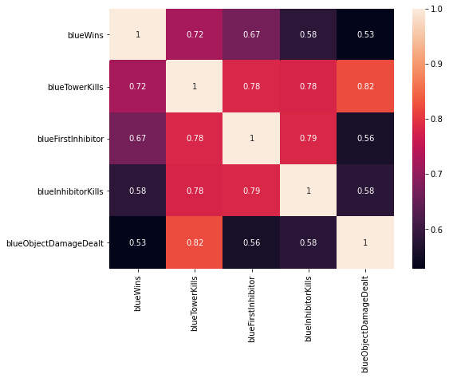
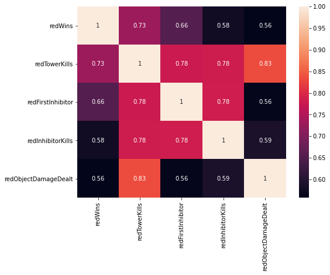
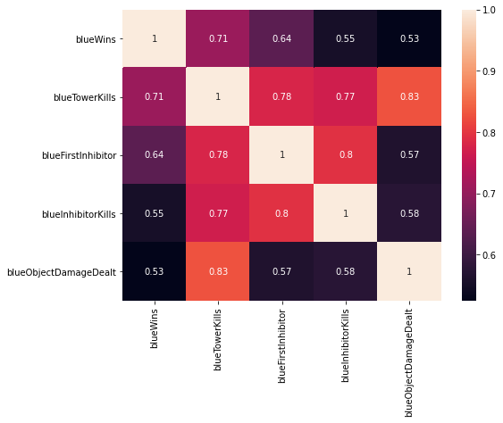
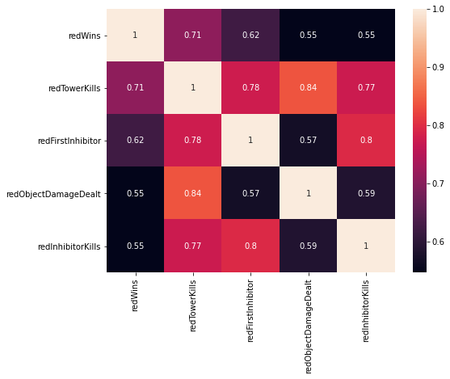

# riot-lol-match-trends
Analyzing League of Legends game data to find trends.

## Hypothesis | The map in League of Legends is one-sided, in favor of the blue side.

How did I come to this hypothesis? 
I have been playing League of Legends on and off for more than six years. In that time, I often felt that the map was slightly in favor of the blue team due to the placement of the HUD and the layout of the map. The blue team has a favorable position when coming to contest the largest obective in the game, Baron Nashor. Not only this, but the placement of the HUD at the bottom center of the screen forces the Red team player to play with their camera un-fixed on their champion in order to ensure it is not blocking their enemy. If someone is not used to playing with their camera like this, or opts not to un-fix their camera and play with the slight vision block, I believe this map impact the viewable win percentages in the data we're about to review. Let's do this!

## Data 
Please view Data acknowledgements file in Data Files folder.

## Cleaning
The dataset was free of null values and other common cleaning issues. The data types were properly detected by Pandas and the DataFrame was workable right after import. I started by separating the dataframes based off of team, and then from wins and losses. From there, I continued my analysis.

## Win Rates
The first, and most obvious thing to check for this hypothesis, is how many times each time one on average. 

### Master Elo

Blue won a total of 53041 matches.
Red won a total of 54084 matches.
The difference is 1043 - in favor of the Red team.
Percentage of wins for blue is: 0.495%
Percentage of wins for red is: 0.505%

### Grand Master Elo

Blue won a total of 32659 matches.
Red won a total of 33237 matches.
The difference is 578 - in favor of the Red team.
Percentage of wins for blue is: 0.496%
Percentage of wins for red is: 0.504%

### Challenger Master Elo

Blue won a total of 13454 matches.
Red won a total of 13450 matches.
The difference is 4 - in favor of the Blue team.
Percentage of wins for blue is: 0.50007%
Percentage of wins for red is: 0.49993%

## Gold Income vs. Game Length

### Master Elo

### Grand Master Elo

### Challenger Master Elo

## Other Charts 
Please view the jupyter notebook + notebook report files in 'Notebooks' folder. There is a plethora of histograms comparing wins against objectives and kills. 

## Correlation

### Master

### Grand Master

### Challenger 

# Conclusion

There was no statistical signifiance between one side winning more than the other. The means are extremely close to one another, and the frequencey off statistically significant winning events are also extremely close and within a margin of error. Whilst this dataset cannot speak to the issue of the HUD being in the way, red did win more than blue within the Master and Grand Master rankings. In Challenger, blue had 4 more matches won over red. There is a noticable decrease in Red's margin of total won matches over blue as you go up in Rank. Though, this is likely do to the limited size of my data. The dataset for Master is larger than Grand Master and Challenger. And the data for Grand Master is larger than the data for Challenger. As stated before, there is no statistical signifiance between one side winning more than the other. What DOES matter is objectives. Objectives in the game have the highest statistically significant correlation to a win than any other variable.

Thus, my hypothesis was proven wrong by my analysis!
